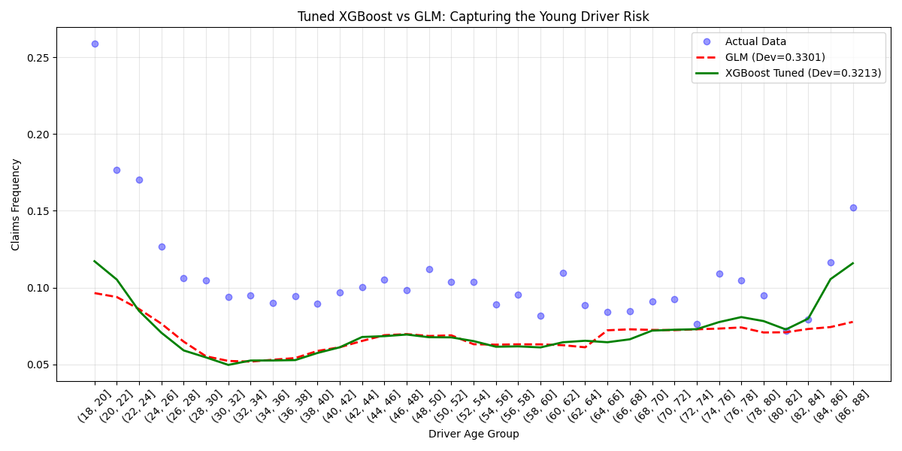
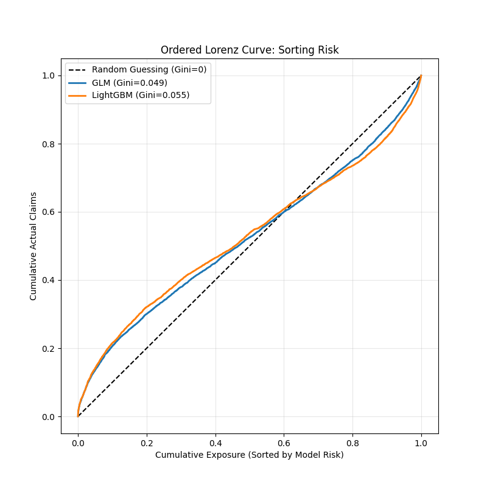
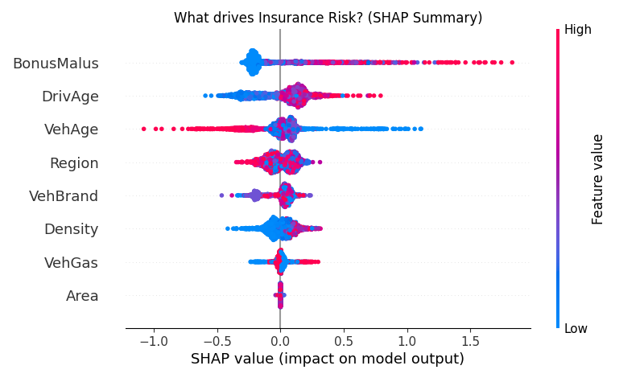

# Auto Insurance Pricing Engine: GLM vs. LightGBM

## 📌 Project Overview
An end-to-end actuarial pricing engine built to challenge traditional **Generalized Linear Models (GLMs)** against modern Machine Learning techniques (**XGBoost** & **LightGBM**) on the French MTPL dataset (600k+ policies).

The goal: **Identify non-linear risk factors** (like young driver risk) that traditional models miss, while maintaining regulatory explainability.

## 📊 Key Results
| Model | Poisson Deviance | Gini Coefficient | Verdict |
|-------|------------------|------------------|---------|
| **GLM (Baseline)** | 0.3301 | 0.049 | Stable standard |
| **XGBoost** | 0.3218 | N/A | High accuracy |
| **LightGBM (Tuned)** | **0.3205** | **0.055** | **Champion** |

* **Accuracy:** Reduced error (Deviance) by ~3% compared to GLM.
* **Ranking:** Improved risk sorting (Gini) by ~12%, proving the ML model is superior at identifying high-risk drivers to avoid adverse selection.

## 🛠️ Technical Implementation
* **Dual-Pipeline Architecture:**
    * *GLM Pipeline:* Uses **Binning** (KBinsDiscretizer) and One-Hot Encoding to force linearity.
    * *ML Pipeline:* Uses **Ordinal Encoding** and Raw Numerics to preserve non-linear signals.
* **Pricing Engine:** Modeled **Frequency** (Poisson) and **Severity** (Gamma) separately to generate pure premium quotes.
* **Explainability:** Implemented **SHAP (SHapley Additive exPlanations)** to visualize the "Bathtub Curve" of driver age risk.

## 📉 Visualizations

### 1. The Actuarial "Bathtub Curve"
*Validating that the model correctly penalizes young (18-25) and elderly (80+) drivers.*


### 2. The "Adverse Selection" Test (Lorenz Curve)
*LightGBM (Orange) outperforms GLM (Blue) in sorting risky drivers.*


### 3. Model Explainability
*SHAP summary revealing "Bonus-Malus" and "Driver Age" as top risk drivers.*


## 🚀 How to Run
```bash
# 1. Install dependencies
pip install pandas numpy<2.0 scikit-learn lightgbm xgboost shap matplotlib

# 2. Run the Pricing Engine
python pricing_engine_battle.py

# 3. Generate Explainability Charts
python model_explanation.py